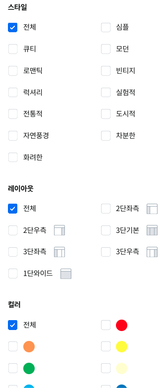
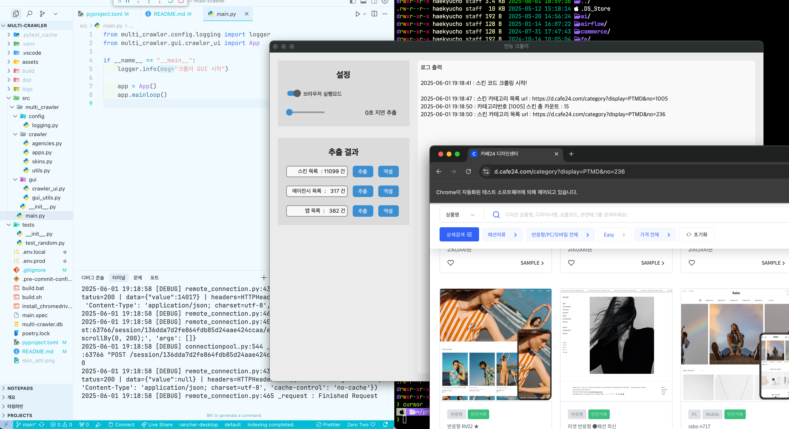

#개발 #개인프로젝트

# 크롤링 & 데이터 수집

## 1. 프로젝트 개요

- **이름**: 스킨 리뷰 데이터 크롤러
- **설명**: [카페24 디자인센터](https://d.cafe24.com/) 의 모든 유료 스킨을 크롤링(+앱스토어)
- **목표**: 모던하게 사용되는 스킨 기능, 항목 분석을 위한 데이터 활용

## 2. 기능 및 요구사항

### 📌 핵심 기능

- 파이썬으로 구축할것
- webdriver를 이용하여 크로미움 기반 크롤링을 실행할것
- 크롤링 속도를 조절 하는 설정을 넣을 것
- 적절한 GUI 프레임워크를 선택하여 어플형태로 구현
- pandas dataFrame형태로 데이터를 만들어 아웃풋은 엑셀, google sheet, csv, rdb등 쉽게 export할수 있는 구조로 만들것

## 3. 아키텍처 및 기술 스택

- python 3.13.0, poetry 2.1.1
- customTkinter(gui)
- padas(dataFrame)
- requests (http call)
- beautifulSoup (html parser)
- selenium

**WSL2 셋팅**

- [xwindow 설치 링크](https://vcxsrv.com/)

```shell
# .zshrc 추가
export DISPLAY=$(ip route | grep default | awk '{print $3}'):0.
export LIBGL_ALWAYS_INDIRECT=1
```

### git repository

https://github.com/chk386/multi-crawler

## 4. 작업 계획

- [x] 프로젝트 셋팅 ✅ 2025-03-25
- [x] UI구성 ✅ 2025-03-25
- [x] 비동기 http통신 ✅ 2025-03-26
- [x] 판다스(DataFrame)생성 ✅ 2025-03-26
- [x] excel 저장 ✅ 2025-03-26

## 크롤링 상세 계획

### 에이전시 목록 추출

에이전시 목록 : https://d.cafe24.com/designer/designer_main?keyword=&searchBrand=&companyType=&productCntMin=0&productCntMax=2686&termType=all&startDate=&endDate=&safety=Y&order=REG_ASC&pageNo=1&isActive=T

**크롤링 하기 굉장히 까다롭게 되어있음. \_\_next_f라는 전역 변수(2차 배열)에 정보가 존재하며 파싱이 불가능에 가까움 -> selenium 을 사용하자**

### 에이전시 정보 수집 항목

```python
    data: dict[str, str | int | datetime] = {
        "agency_id": agency_id,
        "entry_date": entry_date,
        "business_number": business_number,
        "business_address": business_address,
        "contact_person": contact_person,
        "email": email,
        "phone_number": phone_number,
        "website_url": website_url,
        "review_count": int(review_count.replace(",", "") if review_count else 0),
        "review_url": review_url,
        "skin_count": int(skin_count.replace(",", "") if review_count else 0),
        "skin_url": skin_url,
        "created_at": datetime.now(),
    }

# 수집 대상 : 에이전시 명, 입점일, 사업자번호, 통신판매업, 사업장주소, 담당자, 이메일, 전번, 업체url, 리뷰수, 리뷰 url,  보유스킨, 보유스킨 목록url
```

> 크롤링한 정보는 pandas dataFrame으로 변환 후 sqlite에 저장하자.

소개: https://d.cafe24.com/designer/designer_view?agencyId=woozclub
스킨 목록 : https://d.cafe24.com/designer/designer_product?agencyId=woozclub
리뷰 : https://d.cafe24.com/designer/designer_comment?agencyId=woozclub

### 스킨 정보 수집

등록된 총 스킨 수 : 10820

**수집항목**
스킨명, 에이전시, 카테고리, 제품코드, 스킨 상세url, 샘플url
카테고리 반응/PC/모바일 스마트Easy여부 가격 등록일 지원언어 스타일(큐티, 로맨틱, 심플 어쩌구), 레이아웃
가격1,2,3,4,5(단순복사 or 셋팅 추가)



## 개발 환경

- **IDE**: cursor AI
- **lint** : ruff
- **package manager** : poetry
- **GUI 빌드**: pyinstaller
- **버전 관리 전략**: git

## 실행화면


